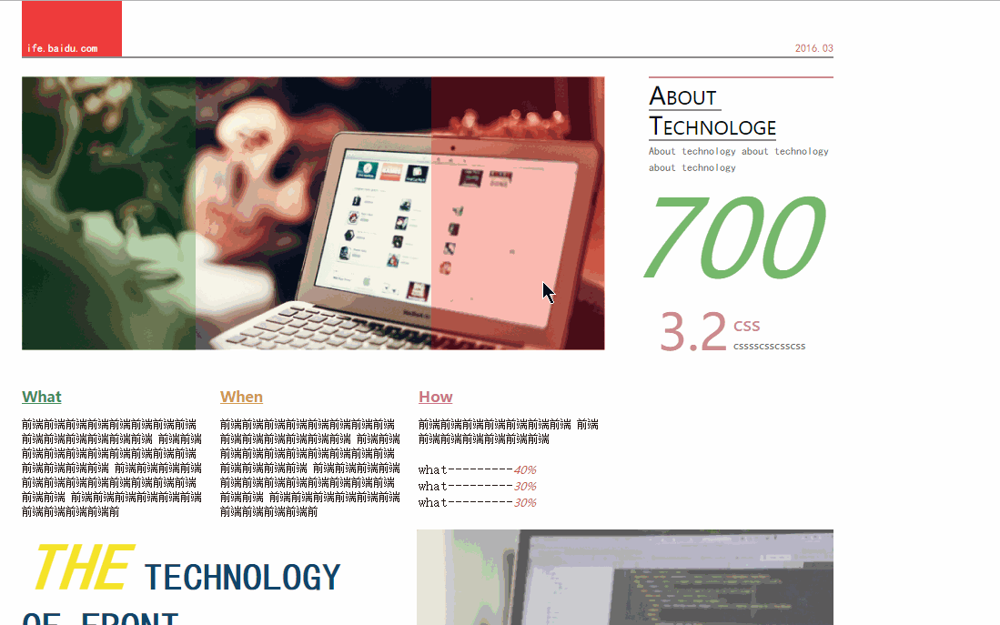
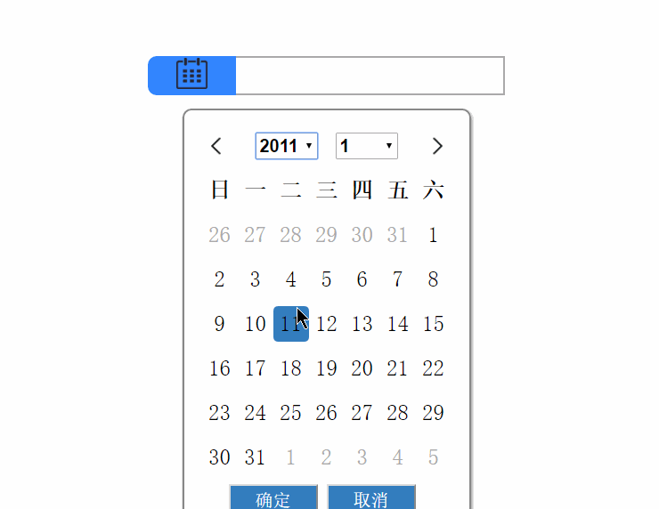

## 静态页面1
***
### 效果展示

[点击 转移到资源页](https://github.com/fanyear/BaiduWebMission/tree/gh-pages/Mission6)

## 静态页面2
***
### 效果展示

[点击 转移到资源页](https://github.com/fanyear/BaiduWebMission/tree/gh-pages/Mission7)

## 基于canvas的飞行器控制台
***
### 效果展示

[点击 转移到资源页](https://github.com/fanyear/BaiduWebMission/tree/gh-pages/Mission28)

## 日历
***
### 效果展示

[点击 转移到资源页](https://github.com/fanyear/BaiduWebMission/tree/gh-pages/Mission42)
